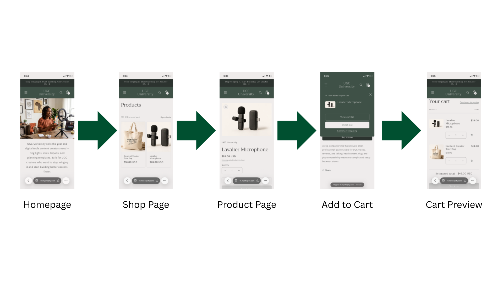
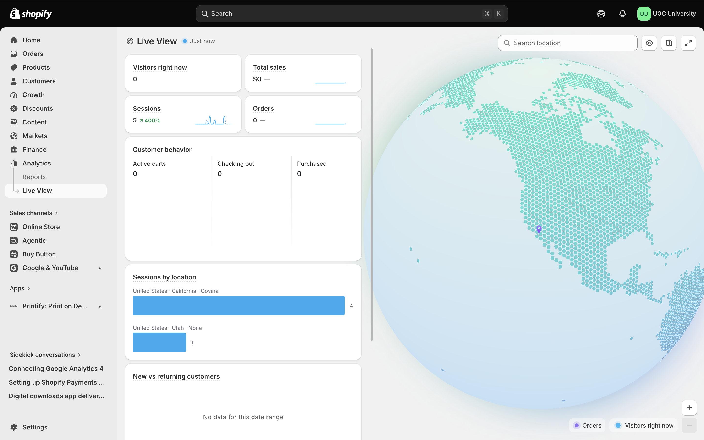

# **Customer journey test**

Test the path from homepage to collection page, product page, cart, and checkout preview if available.

# **Screenshots of testing process**

# **Store strengths**

- **Clear brand identity and category navigation.**

  - The "What is UGC University" section and category CTA buttons help the customer understand what the store sells and can get to the right products in one click, rather than hunting through a generic navigation menu.

- **Well-organized, informative collection pages.**

  - The Equipment collection has its own banner and specific description instead of a repeated site-wide tagline, and sort/filter options (best selling, price, availability) work correctly, so customers can narrow down products efficiently.

- **Functional core purchase flow.**

  - Adding a product to cart, viewing the cart with an accurate estimated total, and proceeding to Shopify's checkout all work without errors, which is the most basic but most important thing a storefront has to get right.

# **Areas for improvement**

- **Reviews aren't functioning yet.**

  - I added a reviews app/section, but since no test review could be submitted, it's not visibly working for a real customer, undercutting social proof until a real review is added.

- **Inconsistent sold-out handling.**

  - Several products show as sold out, and display an active "Add to cart" button. This is a clear bug that could frustrate a customer who gets partway through the flow before hitting a wall.

- **No shipping cost visibility until checkout.**

  - Every product and cart page just says "shipping calculated at checkout," so a customer doesn't know if a \$16 ring light will cost \$4 or \$12 to ship until they're one step from paying, which is a common cause of cart abandonment.

# **Analytics review**

# **Improvement plan**

Before the final submission, my priority is fixing the inconsistencies uncovered during testing rather than adding new features. First, I need to get the customer reviews section actually working and populated, since it currently isn't visible to a real shopper and social proof matters most on product pages. Then I'll clean up sold-out inventory handling so items either restock, get clearly relabeled with a "notify me" option, or are hidden from the collection grid, instead of showing an active add-to-cart button on an unavailable item. I'll also add shipping cost visibility earlier in the journey, either a shipping estimator on the product or cart page, so customers aren't surprised at checkout. Finally, I want to apply the same level of polish across every collection and product page rather than just the ones I focused on first, so the whole store feels finished and consistent by the time it's graded.

# Appendix

- [GitHub Repo](https://github.com/lewiswaddell/ITP-W10.git)

- GitHub Pages
